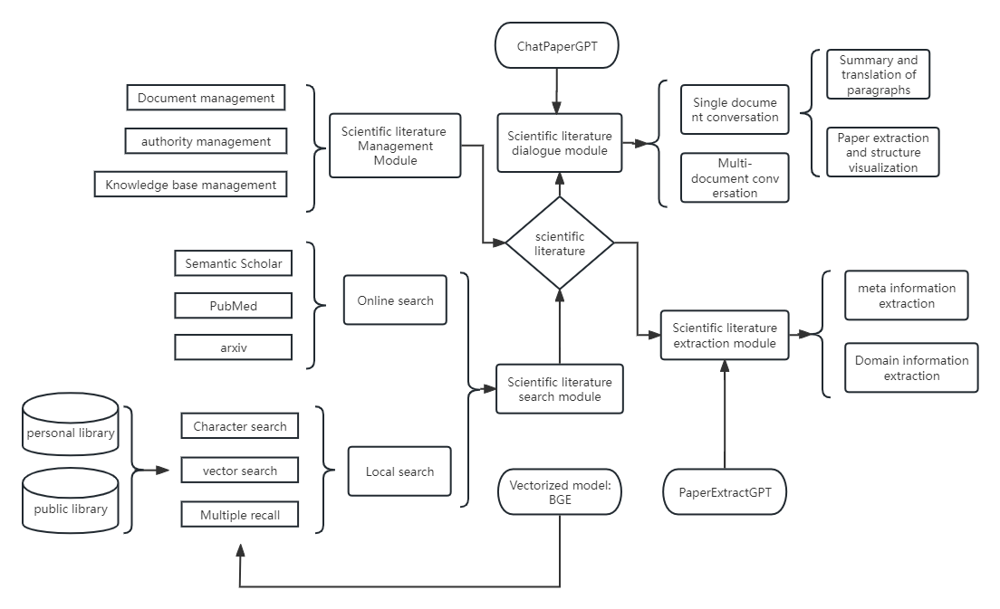
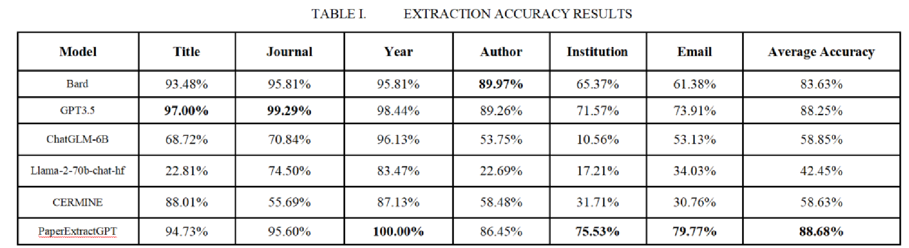
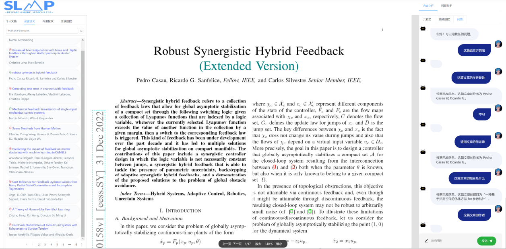
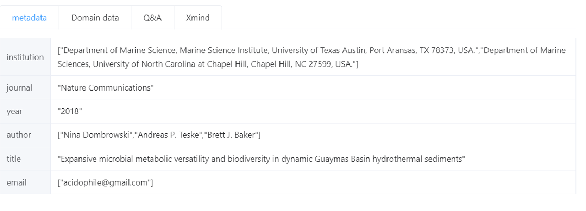
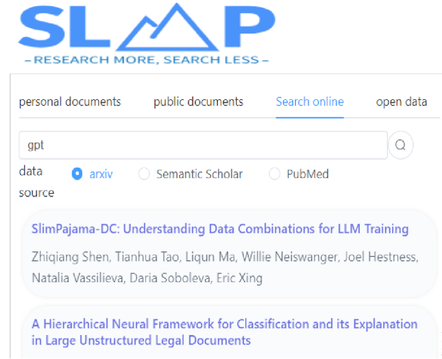
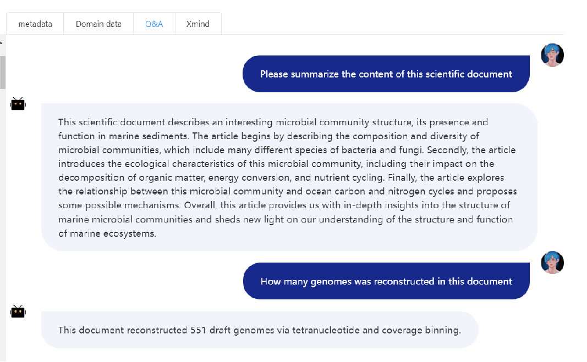

# SLMP_demo
This is the front-end code and back-end code of our paper《SLMP: A Scientific Literature Management Platform Based on Large Language Models》ICKG2024

*Abstract:*

This paper presents a Scientific Literature Management Platform (SLMP) based on large language models (LLMs). The platform consists of four modules: literature management, literature extraction, literature retrieval, 
and question answering. The core techniques used to support the four modules across the platform include a fine-tuned model PaperExtractGPT and a continual pre-training model ChatPaperGPT based on ChatGLM 2
 using the data from scientific research literature, responsible for information extraction and communication, respectively. Due to their powerful capabilities in natural language understanding and generation, LLMs can understand complex scientific concepts based on the 
provided contexts, and thus generate high-quality texts and conduct in-depth information retrieval and question answering. Our platform can help researchers manage and utilize literature more effectively and efficiently for finding relevant literature, 
obtaining required information, and generating new knowledge.

# [front-end code](./paperExtract_frontend)

# [back-end code]()

# Demo video

This is the [demo video](https://youtu.be/6M5pLErK3R0) of paper 《SLMP: A Scientific Literature Management Platform Based on Large Language Models》ICKG2024

